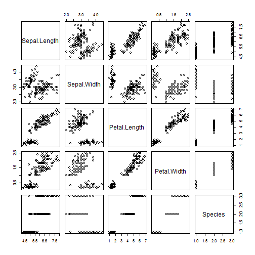

ShinyApplication
========================================================
author: Chin Tham Sang
date:  12/9/2017
autosize: true
transition: rotate
transition-speed: slow

Overview
========================================================

Exploring analysis with several variables.

- Sepal Length
- Sepal Wifth
- Petal Length
- Petal Width

The final application of the exploring analysis is at the following url, https://billychintscts.shinyapps.io/product/


Data used
========================================================
The data used for this application is `IRIS` data set, Summary statistics of this dataset is as follows:


```
  Sepal.Length    Sepal.Width     Petal.Length    Petal.Width   
 Min.   :4.300   Min.   :2.000   Min.   :1.000   Min.   :0.100  
 1st Qu.:5.100   1st Qu.:2.800   1st Qu.:1.600   1st Qu.:0.300  
 Median :5.800   Median :3.000   Median :4.350   Median :1.300  
 Mean   :5.843   Mean   :3.057   Mean   :3.758   Mean   :1.199  
 3rd Qu.:6.400   3rd Qu.:3.300   3rd Qu.:5.100   3rd Qu.:1.800  
 Max.   :7.900   Max.   :4.400   Max.   :6.900   Max.   :2.500  
       Species  
 setosa    :50  
 versicolor:50  
 virginica :50  
                
                
                
```

Application functionality
========================================================
The application is drawing histogram plot of using one of the variables as column selected by a radio button.

To allow the users to select the number of bins to adjust the visualization by a slider.

Github repository:


Scatter Plot to have a General Overview of the dataset.
========================================================


